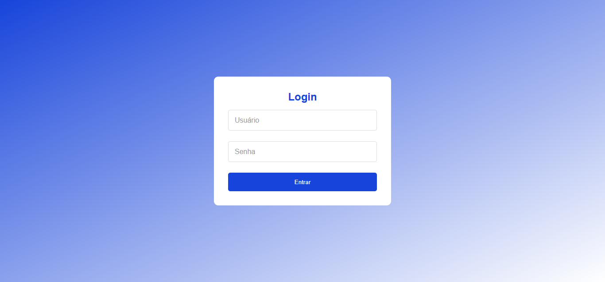
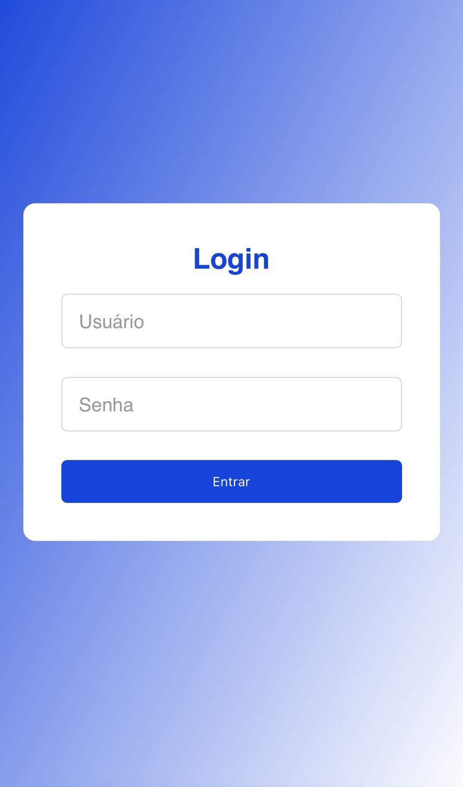

# 🔑 Login Page Responsiva

Uma **página de login moderna e responsiva** feita com **HTML, CSS e JavaScript**.  
Possui validação de email via Regex, feedback visual e adaptação para dispositivos **mobile**, **tablet** e **desktop**.

---

## 🚀 Demonstração

👉 [Acesse o projeto online](https://login-page-lac-alpha.vercel.app/)  

---

## 🛠️ Tecnologias utilizadas

- **HTML5** → Estrutura da página  
- **CSS3** → Estilização e responsividade (media queries para mobile e tablet)  
- **JavaScript (ES6)** → Validação de formulário e lógica de login  

---

## 📂 Estrutura de pastas

```

login-page/
│── index.html
│── style.css
│── script.js
└── README.md

````

---

## 📖 Funcionalidades

✔️ Formulário de login com campos de **usuário** e **senha**  
✔️ **Validação de email** no campo de usuário (Regex)  
✔️ **Senha com mínimo de 8 caracteres**  
✔️ Mensagens de erro amigáveis com `alert`  
✔️ Design responsivo para **mobile**, **tablet** e **desktop**  
✔️ Efeitos de **hover** e **focus** nos inputs e botão  

---

## ⚙️ Como rodar o projeto localmente

1. Clone este repositório:
   ```bash
   git clone https://github.com/jaocoqueiro/login-page.git
   ```
2. Entre na pasta do projeto:

   ```bash
   cd login-page
   ```

3. Abra o arquivo `index.html` diretamente no navegador.

---

## 📱 Responsividade

* **Mobile (até 480px):** inputs e botões mais compactos
* **Tablet (481px até 768px):** espaçamento intermediário
* **Desktop (acima de 768px):** versão completa

---

## 📸 Capturas de tela

### Versão Desktop
---
<div align="center">
  
</div>

### Versão Mobile
---
<div align="center">
  
</div>

## 📄 Licença

Este projeto está sob a licença MIT.
Sinta-se livre para usar, modificar e distribuir.

---

### 👨‍💻 Desenvolvido por [@jaocoqueiro](https://github.com/jaocoqueiro)
